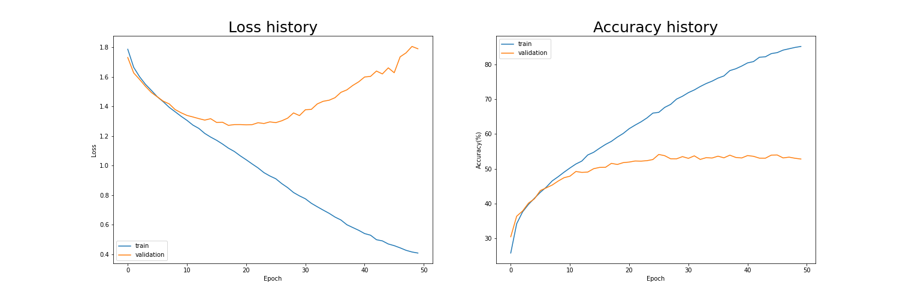

# EmotionNet
## Emotional detection with face landmark detection
https://www.kaggle.com/c/challenges-in-representation-learning-facial-expression-recognition-challenge  
This is current work on final project in Application Programming.
To verify emotion network.
- emotion.py : file with train mode, service mode(real time), image_test mode
- train.py : define training on Network
- data.py : dataset and dataloader used in Network
---
  
1. This is the model concatenate Dlib model with emotion detection model
2. Training and Validation data used FER-2013
3. ADAM Optimizer

---
## Follow Instructions to run program

1. If you have virtual env like conda, you can use it as virtual environment
2. Required package, module
    - pytorch == 1.9.1
    - numpy == 1.21.2
    - opencv-python
    - dlib(Probably you need to install cmake first)
    - torchsummary
    - imutils
    - ...

___
## clone github repository with your own device.
```
    git clone https://github.com/junia3/EmotionNet.git
```

___
## Download dataset from drive
https://drive.google.com/file/d/1UB6LmoIsE-V0FnFICI5WDEj5ZJBkogem/view?usp=sharing

Extract this file into repository, It looks like this.

> emotion_net
>    > data
>    >    - train
>    >    - test
>    >    - data.py

___
## Download required packages
1. pip install pytorch
    - Or you can use conda install pytorch instead
2. pip install cmake
3. pip install opencv-python
4. pip install torchvision
5. pip install imutils
6. pip install torchsummary
7. pip install dlib
8. ... 이후에도 설치할 게 좀 있음

If there is any error message with running code, you can install it in your virtual env with "pip + install + packagename"

___
## Run training mode
```
    python emotion.py --mode train
```

___
## Logging example code

```python
def log_progress(epoch, num_epoch, iteration, num_data, batch_size, loss, acc):
    progress = int(iteration / (num_data // batch_size) * 100 // 4)
    print("Epoch : %d/%d >>>> train : %d/%d(%.2f%%) ( " % (epoch, num_epoch, iteration, num_data // batch_size, iteration / (num_data // batch_size) * 100)
          + '=' * progress + '>' + ' ' * (25 - progress) + " ) loss : %.6f, accuracy : %.2f%%" % (loss, acc * 100), end='\r')
```
pycharm과 같은 IDE에서는 위를 사용하면 되고
jupyter notebook이나 Colab 등등에서는 '\r'이 의도대로 작동을 안해서 출력이 아예 안보이더라고? 그래서 밑에로 대체해서 사용함  

```python
def log_progress(epoch, num_epoch, iteration, num_data, batch_size, loss, acc):
    progress = int(iteration / (num_data // batch_size) * 100 // 4)
    print("Epoch : %d/%d >>>> train : %d/%d(%.2f%%) ( " % (epoch, num_epoch, iteration, num_data // batch_size, iteration / (num_data // batch_size) * 100)
          + '=' * progress + '>' + ' ' * (25 - progress) + " ) loss : %.6f, accuracy : %.2f%%" % (loss, acc * 100))
```

**근데 이렇게 하면 각 iteration 마다 줄이 출력이 되니까**  
**크롬 창에서 출력 지우기를 콘솔에 넣어 사용하거나 아니면 걍 iteration % ?? 조건을 넣어서 출력 수를 줄이는 방법 추천**
```javascript
function CleanCurrentOutput() {
 var btn = document.querySelector(".output-icon.clear_outputs_enabled.output-icon-selected[title$='현재 실행 중...'] iron-icon[command=clear-focused-or-selected-outputs]");
 if(btn) {
  console.log("10분마다 출력 지우기");
  btn.click();
  }
 }
setInterval(CleanCurrentOutput, 1000 * 60 * 10);
```
___
## Simpler model you can use

Model structure is imple, but validation/test accuracy not good.

```python
import torch
import torch.nn as nn

class EmotionNet(nn.Module):
    def __init__(self, num_classes = 7, init_weights = True):
        super(EmotionNet, self).__init__()
        self.conv1 = nn.Sequential(nn.Conv2d(in_channels = 1,
                                            out_channels = 32,
                                            kernel_size = 3,
                                            stride = 1),
                                    nn.ReLU(),
                                    nn.Conv2d(in_channels = 32,
                                            out_channels = 64,
                                            kernel_size = 3,
                                            stride = 1),
                                    nn.ReLU(),
                                    nn.MaxPool2d(kernel_size = 2),
                                    nn.Dropout(0.25))
        
        self.conv2 = nn.Sequential(nn.Conv2d(in_channels = 64,
                                              out_channels = 128,
                                              kernel_size = 3,
                                              stride = 1),
                                    nn.ReLU(),
                                    nn.MaxPool2d(kernel_size = 2, stride = 2),
                                    nn.Conv2d(in_channels = 128,
                                              out_channels = 128,
                                              kernel_size = 3,
                                              stride = 1),
                                    nn.ReLU(),
                                    nn.MaxPool2d(kernel_size = 2),
                                    nn.Dropout(0.25))

        self.linear = nn.Sequential(nn.Linear(in_features = 4*4*128, out_features = 1024),
                                    nn.ReLU(),
                                    nn.Dropout(0.5),
                                    nn.Linear(in_features = 1024, out_features = num_classes))

        if init_weights:
            self._initailize_weight()

    def _initailize_weight(self):
        for module in self.modules():
            if isinstance(module, nn.Conv2d):
                nn.init.kaiming_normal_(module.weight, mode = 'fan_out', nonlinearity = 'relu')
                if module.bias is None:
                    nn.init.constant_(module.bias, 0)

            elif isinstance(module, nn.Linear):
                nn.init.normal_(module.weight, 0, 0.01)
                nn.init.constant_(module.bias, 0)

    def forward(self, input):
        output = self.conv1(input)
        output = self.conv2(output)
        output = torch.flatten(output, 1)
        output = self.linear(output)
        return output
```

- **Use 64 batches per each training epoch**
- **Use 50 epochs to train**
___
### Result of Simpler model


___
## Additional contents  
CPU/GPU RAM capacity issue가 생겨서
training시에 2 epoch 이후로 학습이 안되는 경우 생김 -> 고용량 GPU로 갈아탐..ㅠ
그리고 에폭마다 cache를 비우도록 해서 학습을 진행.. 어떻게 될려나
